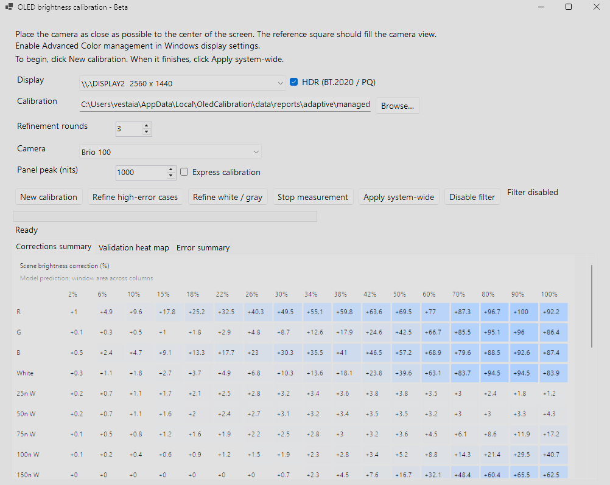
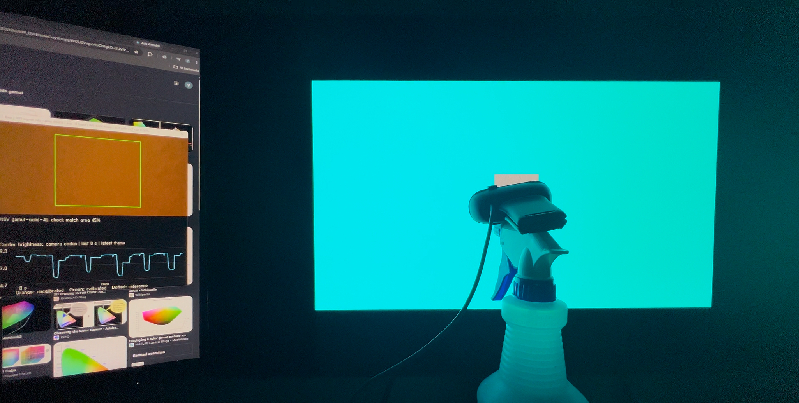
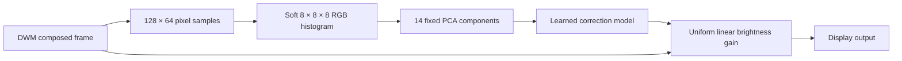
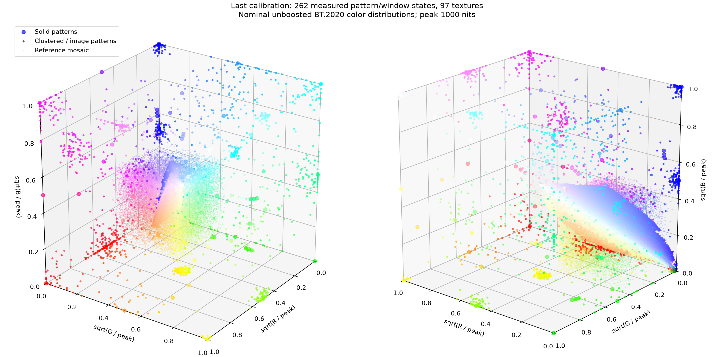

# OLED Anti-Dimming

A Windows calibration utility that reduces content-dependent OLED dimming using relative webcam measurements and a GPU display filter. Initial beta: calibration and filtering are implemented; compatibility and performance are still being tested.



## Tutorial



1. Enable HDR or Advanced Color management in Windows as appropriate for your display.
2. Place the camera as close as possible to the center of the screen. The center reference patch should fill the camera's view.
3. Select the camera and display, set the panel peak-brightness sampling limit (default 1,000 nits), then create a new calibration.
4. Review the correction and validation summaries, then choose **Apply system wide**.

Windows requests administrator access for the application. Windows manages ICC profiles and VCGT calibration; this utility does not apply them separately. Calibration data persists under `%LOCALAPPDATA%\OledCalibration\data`, independently of executable versions. Packaged helpers are extracted automatically on first launch.

The sampling limit bounds calibration stimuli; it does not clamp output. Compensation is limited by the monitor's available brightness headroom. Relative webcam matching cannot establish absolute luminance or accurate colorimetry, and the display's physical full-screen brightness limit remains unavoidable.

## Existing features

- **APL-dependent dimming compensation.** Counters brightness changes caused by average picture level and the scene's color distribution. Applies a uniform multiplier in linear color space to preserve channel ratios.
- **PCA analysis of screen-space content.** Samples pixels into a joint three-dimensional RGB histogram, then uses principal component analysis to describe the distribution for the learned dimming model. Colored mixtures retain distribution information rather than being reduced to their average color alone.
- **System-wide application.** Corrects the selected display through a Desktop Window Manager hook derived from [dwm_lut](https://github.com/ledoge/dwm_lut). Content that bypasses DWM composition is outside the filter's coverage.
- **Fully automatic calibration after setup.** Select a display and webcam, position the camera, and start calibration. The utility generates patterns, measures latency and settling, matches relative brightness, fits the model, and validates the result. No colorimeter or Python installation is required for the application. Exposure must remain locked; cameras without working API exposure control require manual setup.
- **Adaptive sampling algorithms.** Coarse measurements identify dimming regions; additional patterns and refinement samples target poorly covered regions and validation errors. Flat regions are skipped to reduce measurement time.

## Planned features

- **Custom EOTF targets.** Currently targets PQ (SMPTE ST 2084). Planned options include custom highlight roll-offs and advanced, headroom-aware tone mapping, including investigation of SMPTE ST 2094-50. Apple's [Headroom Adaptive Gain Curve](https://developer.apple.com/documentation/colorsync/headroom-adaptive-gain-curve) uses this metadata standard; its [EDR rendering pipeline](https://developer.apple.com/videos/play/wwdc2021/10161/) is a related reference for adapting content to available display headroom. These tone-mapping options are not implemented yet.
- **Improve calibration speed.** Reduce measurement and convergence time while retaining sufficient coverage of color and brightness distributions.

## Design

The system learns a monitor's response to a **distribution of pixel colors**,
then predicts one brightness gain for the current composed scene. It does not
infer a panel's physical RGB/white-subpixel drive algorithm or assume additive
subpixel power. The representation captures color-dependent behavior without
treating a mixture of saturated colors as an equivalent uniform gray.



### DWM integration and frame ownership

The native hook intercepts DWM's `COverlayContext::Present` and controls
`IsCandidateDirectFlipCompatible` and `OverlaysEnabled` for the corrected output.
Matching Microsoft symbols resolve private functions for the exact installed
`dwmcore.dll`; the address record is bound to the module timestamp and image size.
The implementation derives from dwm_lut, with a DisplayCore back-buffer path for
current Windows builds. Hardware-protected buffers are skipped.

A pristine scene texture is retained per output. Fresh buffers are copied in full;
subsequent frames update the cache from dirty rectangles. Analysis and rendering
read this source, avoiding repeated multiplication of unchanged desktop pixels.
The output pass covers the complete buffer because changing scene gain affects
pixels outside the current damage region. Enable and disable invalidate the
desktop, and re-enable rebuilds the model and frame cache on the compositor thread.

The graphics pass saves and restores DWM's full D3D11 context state. Hook control
and mutable state are serialized. The DLL remains pinned; Disable removes the
detours without freeing callback code or trampolines. The `OverlaysEnabled`
wrapper also preserves volatile registers relied on by DWM's internal leaf-call
optimizations. See [hook stability](docs/hook-stability.md) for evidence and limits.

### Display subsampling and three-dimensional histogram

Each frame uses a fixed **128 × 64 grid**, or 8,192 samples, spanning the actual
display buffer. Sample coordinates are scaled independently by width and height,
so other resolutions and aspect ratios retain full-buffer coverage. This is a
spatial approximation: small features can be missed, and moving content can
slightly alter the sampled distribution.

HDR scRGB samples are converted to linear BT.2020 for analysis, using 80 nits per
scRGB unit. The SDR path decodes sRGB and uses its reference-white scale. Each
channel is encoded as `sqrt(max(channel_nits, 0) / 10000)`, then assigned to an
**8 × 8 × 8 joint RGB histogram**. Trilinear weighting distributes mass among the
eight neighboring bins, reducing discontinuities at bin boundaries. Encoding
bounds affect the descriptor only; they do not clamp rendered highlights.

The GPU builds 32 histograms in workgroup-local shared memory using integer
atomics, then reduces them. The normalized histogram preserves multimodal
distributions and relative population weights. It deliberately discards spatial
layout and temporal history; it cannot represent layout-sensitive or long-term
panel protection behavior.

### PCA generation and correction inference

Before camera acquisition, the application creates histograms for planned
patterns and deterministic synthetic distributions bounded by the selected panel
peak. It mean-centers these training histograms and uses orthogonal power
iteration on their covariance to learn **14 principal components**. This step
requires no camera labels. The basis is frozen across acquisition and refinement.

At runtime, the GPU projects the scene histogram relative to an all-black
histogram onto the exported basis. A Gaussian radial-basis model, fitted with
regularization to measured log gains and scaled PCA coordinates, predicts the
correction. An explicit black anchor establishes the baseline. The prediction
is converted to a gain of at least one; CPU and GPU encoders and inference are
checked for agreement. PCA is lossy: distributions indistinguishable in these
14 components can still produce different panel responses.

### Adaptive gamut-space calibration

Initial solid-color coverage includes cube vertices, edge centers, face centers,
the black-to-white diagonal, and deterministically spaced interior points chosen
by greedy maximin search. Calibration coordinates use square-root linear
BT.2020 channels relative to the chosen peak; this spacing is not a claim of
perceptual uniformity. Representative clustered patterns contain two to five
color populations with varying spreads and unequal bright/dim weights, including
20/80 and 80/20 mixtures. Public-domain photographs provide additional checks.



*Example from a completed calibration: 262 measured pattern/window states and
97 textures at a nominal 1,000-nit peak. The plot shows nominal, unboosted solid
colors, clustered/image distributions, and the center reference mosaic. It is
an illustration of sampled colors, not a luminance measurement or accuracy claim.*

Coarse window sweeps proceed from large areas toward smaller areas and skip known
flat regions. Fresh validation candidates include arbitrary single gamut points
and clustered distributions at new window sizes. Coverage scores prioritize
empty regions in color space and histogram/PCA space without measuring every
candidate. Failed, stable checks generate nearby new areas, brightnesses, or
distribution variants; they are added to the training set, with separate local
holdouts. Refinement starts at the current model prediction rather than unity.
The PCA basis stays fixed while the correction model is refitted.

Refinement stops locally when matching errors are small, the panel response
plateaus, or the configured round limit is reached. A final global validation
checks for regressions. The current 1% threshold is relative camera-code error
with a noise floor, not 1% measured luminance. Remaining errors are recorded
rather than silently declared converged. See [gamut sampling](docs/gamut-sampling.md).

### Relative camera matching and output correction

The center reference is a fine pixel mosaic with nominal mean 100 nits, whose
contribution is included in the scene histogram. Surrounding content changes
while the reference location remains fixed. Camera samples average a broad
detected region within the patch. Exposure and white balance remain fixed during
a measurement phase; exposure may be retuned between phases.

A binary brightness sequence measures end-to-end latency and response settling.
Feedback waits for the measured response and uses fresh settled frames. Coarse
control approaches the target quickly; small, discrete final corrections avoid
oscillation. Camera codes are treated as relative matching signals, never as a
linear luminance meter. Plateau detection stops increases that produce no useful
response.

The final pixel pass applies **one multiplier in linear light**. The HDR fast
path multiplies original scRGB directly, preserving channel ratios, negative
scRGB values, alpha, and highlight detail without spatial resampling. It adds
no software panel-peak clamp. Windows owns ICC/VCGT processing; the application
does not install a separate color transform. Current calibration targets PQ;
custom EOTFs and roll-offs remain planned work.

The GPU performs analysis, inference, and application without a per-frame CPU
readback. Full-frame copying and filtering still have a cost. Existing isolated
RTX 4070 Ti measurements were approximately 133–148 microseconds per complete
1440p test frame; the target of less than 5% GPU cost at 500 Hz has not been
demonstrated under application contention. Idle clocks and live DWM workloads
must be considered when measuring performance.

## Build from source

Requires Windows x64, Visual Studio C++ build tools, the Windows SDK (including Debugging Tools for Windows), the .NET 10 SDK, and Python 3 for build-time hook source generation. Python is not a runtime application dependency.

```powershell
./build-single.ps1 -OutputDirectory build/single
```

Launch `build/single/OledCalibration.exe`. The compressed, self-contained package contains the .NET runtime and native helpers in a single distributable executable. Build paths currently assume standard Visual Studio and Windows SDK locations.

Private DWM hooks are tied to the installed Windows build. Current support targets Windows 11 24H2 and later with matching Microsoft symbols; older Windows support is deferred. Updating an already loaded hook requires signing out and back in. The latest overlay-register fix has passed isolated regression tests, but live desktop/game validation remains pending. See [hook stability](docs/hook-stability.md).

## Development notes

- [PCA histogram model](docs/histogram-pca.md)
- [Adaptive gamut sampling](docs/gamut-sampling.md)
- [Regression checks](tests/README.md)
- [Third-party components and licenses](THIRD_PARTY_NOTICES.md)

The current application uses the PCA histogram model exclusively. Historical
prototypes and generated reports have been removed from the working source tree;
the initial Git commit preserves earlier prototype source for reference. Third-party sources are
vendored with their original licenses. The DWM hook is a GPLv3 derivative; see its
license and the third-party notices before redistribution.

## License

OLED Anti-Dimming's original code and its modified DWM hook are licensed under
the **GNU General Public License version 3 only** (`GPL-3.0-only`). See [LICENSE](LICENSE).
Third-party components retain their original licenses and notices; MinHook uses
its BSD-style license, and the benchmark photographs retain their public-domain
status. See [THIRD_PARTY_NOTICES.md](THIRD_PARTY_NOTICES.md).
