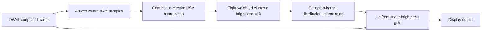

# Filter design

The current experimental calibration uses the [smoothed HSV model](smoothed-hsv.md).
The details below describe earlier compatible models.

The current experimental calibration uses the [smoothed HSV model](smoothed-hsv.md).
The details below describe earlier compatible models.

The system learns a monitor's response to a **distribution of pixel colors**,
then predicts one brightness gain for the current composed scene. It does not
infer a panel's physical RGB/white-subpixel drive algorithm or assume additive
subpixel power. The representation captures color-dependent behavior without
treating a mixture of saturated colors as an equivalent uniform gray.

### DWM integration and frame ownership

The native hook intercepts DWM's `COverlayContext::Present` and controls
`IsCandidateDirectFlipCompatible` and `OverlaysEnabled` for the corrected output.
Matching Microsoft symbols resolve private functions for the exact installed
`dwmcore.dll`; the address record is bound to the module timestamp and image size.
The implementation derives from dwm_lut, with a DisplayCore back-buffer path for
current Windows builds. Hardware-protected buffers are skipped.

A pristine scene texture is retained per output. Fresh buffers are copied in full;
subsequent frames update the cache from dirty rectangles. Analysis and rendering
read this source, avoiding repeated multiplication of unchanged desktop pixels.
The output pass covers the complete buffer because changing scene gain affects
pixels outside the current damage region. Enable and disable invalidate the
desktop, and re-enable rebuilds the model and frame cache on the compositor thread.

The graphics pass saves and restores DWM's full D3D11 context state. Hook control
and mutable state are serialized. A small unload bridge remains resident; Disable drains callbacks, removes the
detours and releases the main payload, allowing a changed filter DLL to load. The `OverlaysEnabled`
wrapper also preserves volatile registers relied on by DWM's internal leaf-call
optimizations. See [hook stability](hook-stability.md) for evidence and limits.

### Display subsampling and distribution encoding

Each frame uses a user-selected aspect-aware grid: Quality about 60,000 cells,
Balanced about 25,000, Performance about 10,000, or Custom 256 to 1,000,000.
Grid width is rounded from `sqrt(cells * width / height)`; height is rounded
from `cells / grid_width`, capped at texture dimensions. Small features may
be missed. No CPU image readback is introduced.

HDR scRGB is converted to linear BT.2020 using 80 nits per unit. SDR is decoded
from sRGB. Reference-normalized circular HSV uses four coordinates:
`S^2 cos(H)/sqrt(3)`, `S^2 sin(H)/sqrt(3)`, `S^2 sqrt(2/3)`, and
`B sqrt(V/10000)`, where B is about 34.52 and V is the maximum linear RGB channel in nits.
Statistical domain limits do not clamp rendered signals.

Eight weighted k-means clusters are fitted for eight iterations after actual-scene
farthest-point initialization. Final assignment computes population and RMS
spread at the final centers. Forty-eight descriptor values retain eight centers,
populations and spreads; a further value records exact non-black coverage. Exact pattern raster populations, including the mosaic
probe and black surrounding pixels, are used during calibration; runtime uses
its sampling grid. Histogram/PCA generation is no longer needed for new models.
Old PCA calibrations remain loadable.

### Correction inference

The correction model interpolates measured log gains using normalized inverse
seventh-power distance weights. Squared distance uses Gaussian-kernel MMD between weighted k-means components,
including their isotropic RMS spread. No explicit window-size cost is added.
Equivalent component splits preserve distance; eight components remain an approximation.
See [color-clusters.md](color-clusters.md) for bandwidth and reference normalization.
Exact duplicate measured states share one contribution with averaged log gains. An all-black unity-gain
anchor remains. See [color clusters](color-clusters.md) for format and limitations.

### Adaptive gamut-space calibration

Initial solid-color coverage includes cube vertices, edge centers, face centers,
the black-to-white diagonal, and deterministically spaced interior points chosen
by greedy maximin search. Calibration coordinates use square-root linear
BT.2020 channels relative to the chosen peak; this spacing is not a claim of
perceptual uniformity. Representative clustered patterns contain two to five
color populations with varying spreads and unequal bright/dim weights, including
20/80 and 80/20 mixtures. Public-domain photographs provide additional checks.

*Example from a completed calibration: 262 measured pattern/window states and
97 textures at a nominal 1,000-nit peak. The plot shows nominal, unboosted solid
colors, clustered/image distributions, and the center reference mosaic. It is
an illustration of sampled colors, not a luminance measurement or accuracy claim.*

Coarse window sweeps run from large to small areas, retaining inferred unity-gain
anchors when flatness permits skipping. Refinement generates novel distributions
and selects low-confidence neighborhoods: nearby samples raise confidence,
while local gain slopes lower it. No measurement-error ranking is used for new
sample selection. Training updates the native online model continuously.
Validation freezes it for each pass, then adds stable validation labels to training.
Three refinement rounds remain the default. See [gamut sampling](gamut-sampling.md).

### Relative camera matching and output correction

The center reference is a fine pixel mosaic with nominal mean 100 nits, whose
contribution is included in the scene distribution. Surrounding content changes
while the reference location remains fixed. Camera samples average a broad
detected region within the patch. Exposure and white balance remain fixed throughout a session. Periodic reference
checks update the target and warn about substantial brightness drift.

A binary brightness sequence measures end-to-end latency and response settling.
Feedback waits for the measured response and uses fresh settled frames. Coarse
control approaches the target quickly; small, discrete final corrections avoid
oscillation. Camera codes are treated as relative matching signals, never as a
linear luminance meter. Plateau detection stops increases that produce no useful
response.

The final pixel pass applies **one multiplier in linear light**. The HDR fast
path multiplies original scRGB directly, preserving channel ratios, negative
scRGB values, alpha, and highlight detail without spatial resampling. It adds
no software panel-peak clamp. Windows owns ICC/VCGT processing; the application
does not install a separate color transform. Current calibration targets PQ;
custom EOTFs and roll-offs remain planned work.

The GPU performs analysis, inference and application without frame readback.
Copying, clustering, transport matching and rendering still have costs. The earlier
60k-sample/eight-iteration microbenchmark took about 100 microseconds at normal
clocks, excluding actual-scene seeding, final spread calculation, transport
inference and rendering. It is not a total-filter performance claim. The 5% budget
at 1440p/500 Hz remains an optimization target; idle clocks and contention matter.
